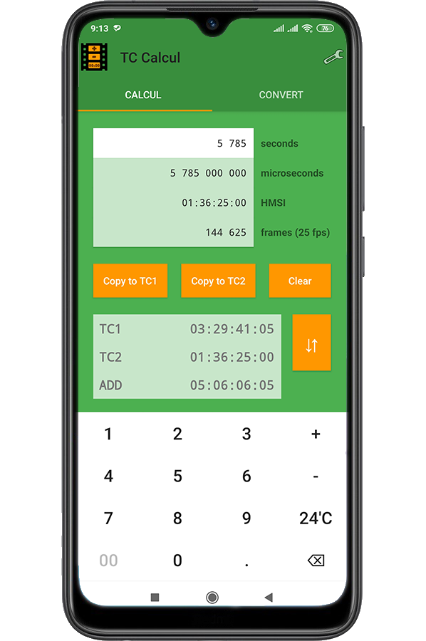

# Politique de confidentialité et de protection des données personnelles

*Application développée par David de Lorenzo*

TC CALCUL ne collecte aucune donnée personnelle.

La technologie utilisée ne requiert aucune donnée personnelle pour fonctionner: aucun numéro de téléphone, mail, nom, prénom, adresse, date de naissance…

TC CALCUL ne demande pas d’accéder à vos contacts, à vos fichiers ou à quelque autre donnée qui vous appartient (L'application utilise simplement pour son fonctionnement des données purement techniques, sans néanmoins les consulter, les collecter ou les conserver).

Lorsque vous installez l'application, il ne vous est pas demandé de créer un compte.

Lorsque vous utilisez TC CALCUL, nous n’avons accès à aucune information.

Si vous désinstallez l’application, il ne restera plus trace de la moindre donnée personnelle. C’est comme si vous ne l’aviez jamais installée.

# Application

TC CALCUL is a handy application for converting, adding, substracting timecodes, in any unit. Very usefull, especially if you work for the TV, video or media industry...

[TC Calcul on the Play Store](https://play.google.com/store/apps/details?id=com.sphinkie.sgtcalcul)

