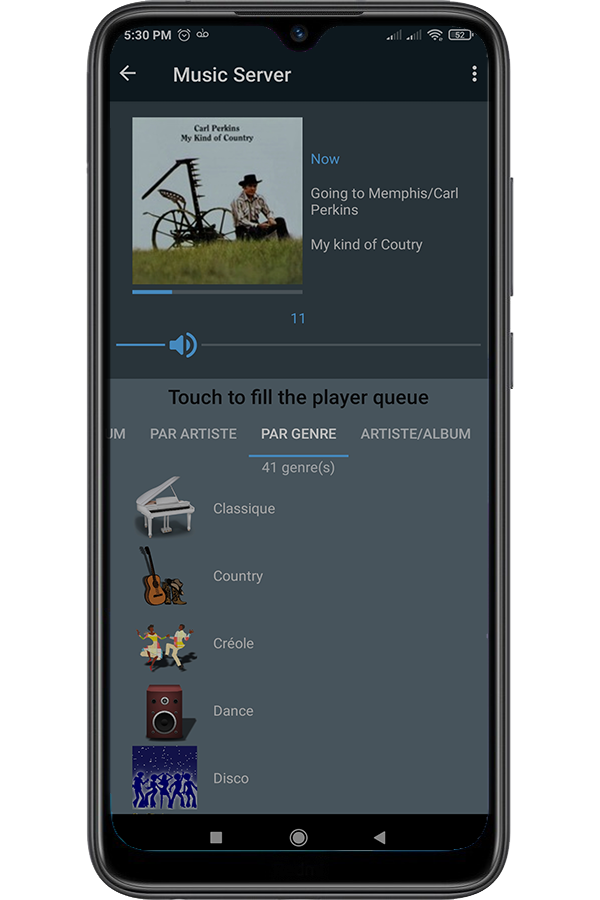

# Politique de confidentialité et de protection des données personnelles

*Application développée par David de Lorenzo*

TiMarantz ne collecte aucune donnée personnelle.

La technologie utilisée ne requiert aucune donnée personnelle pour fonctionner: aucun numéro de téléphone, mail, nom, prénom, adresse, date de naissance…

TiMarantz ne demande pas d’accéder à vos contacts, à vos fichiers ou à quelque autre donnée qui vous appartient (l'application utilise simplement pour son fonctionnement des données purement techniques, à savoir les adresses IP des équipements pilotés).

Lorsque vous installez TiMarantz, il ne vous est pas demandé de créer un compte.

Lorsque vous utilisez TiMarantz, nous n’avons accès à aucune information. 

Si vous désinstallez l’application, il ne restera plus trace de la moindre donnée personnelle. C’est comme si vous ne l’aviez jamais installée.

# Application

With this TiMarantz, you can manage your Marantz Audio Amplifier directly with your smartphone and listen your own music or any web-radio very easily.
You do not need any Heos account, nor any account or subscription to a music major company.

[TiMarantz on the Play Store](https://play.google.com/store/apps/details?id=com.sphinkie.timarantz")

